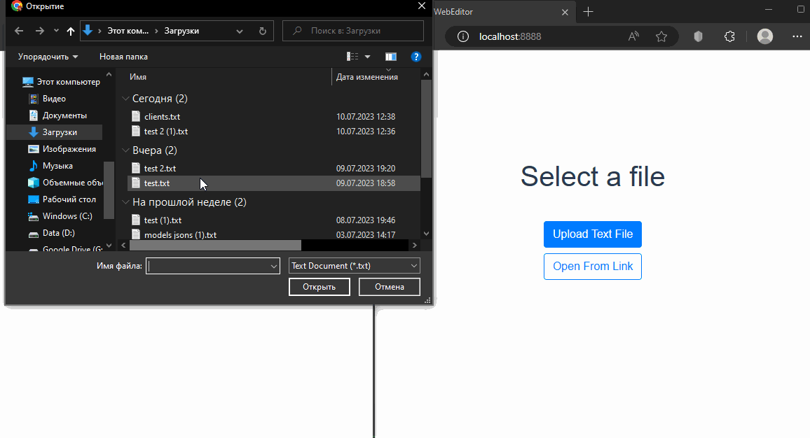
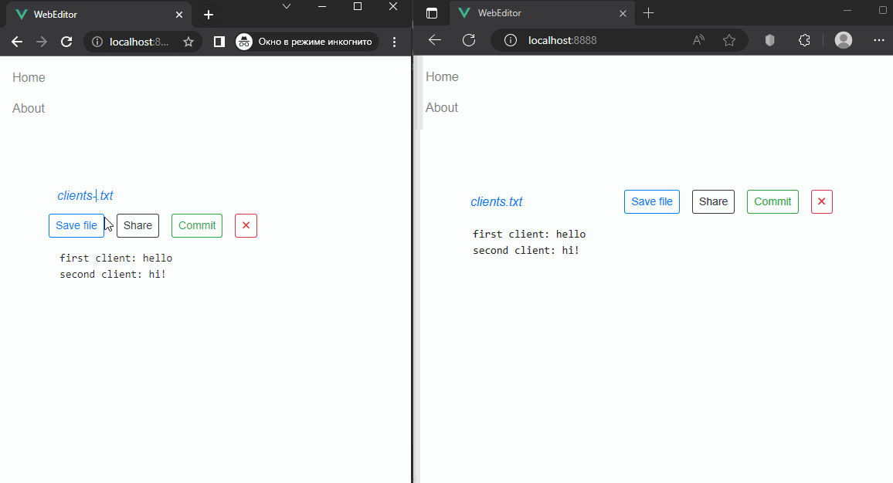

# WebEditor_Client
Client UI for WebEditor app
## Installation
See the instructions for the server application on [WebEditor](https://github.com/NaumovichID/WebEditor).

Follow the instructions below to start the client application (using docker).

### Clone WebEditor_Client repository
1. In the directory where you want to clone the project, run:

    ``git clone https://github.com/NaumovichID/WebEditor_Client``
2. Change the current working directory:

    ``cd WebEditor_Client``

### Running with Docker:

1. Build a docker image named ``vue-app`` with a following command, note that dot ``.`` is a part of the command:

    ``docker build -t vue-app .``
    
2. Run a docker container named ``vue-app-container`` based on the image:

    ``docker run -it -p 8888:8888 --rm --name vue-app-container vue-app``
    
    Note: the ``-it`` instructs Docker to allocate a pseudo-TTY connected to the container’s stdin; creating an interactive bash shell in the container.
   
    To detach from a running container: hold ``ctrl`` + press ``p`` + press ``q``.
3. To stop the container, run:
    
    ``docker stop vue-app-container``

## Functionality showcase

Opening and editing a file by multiple clients:

Renaming and saving a file locally:

